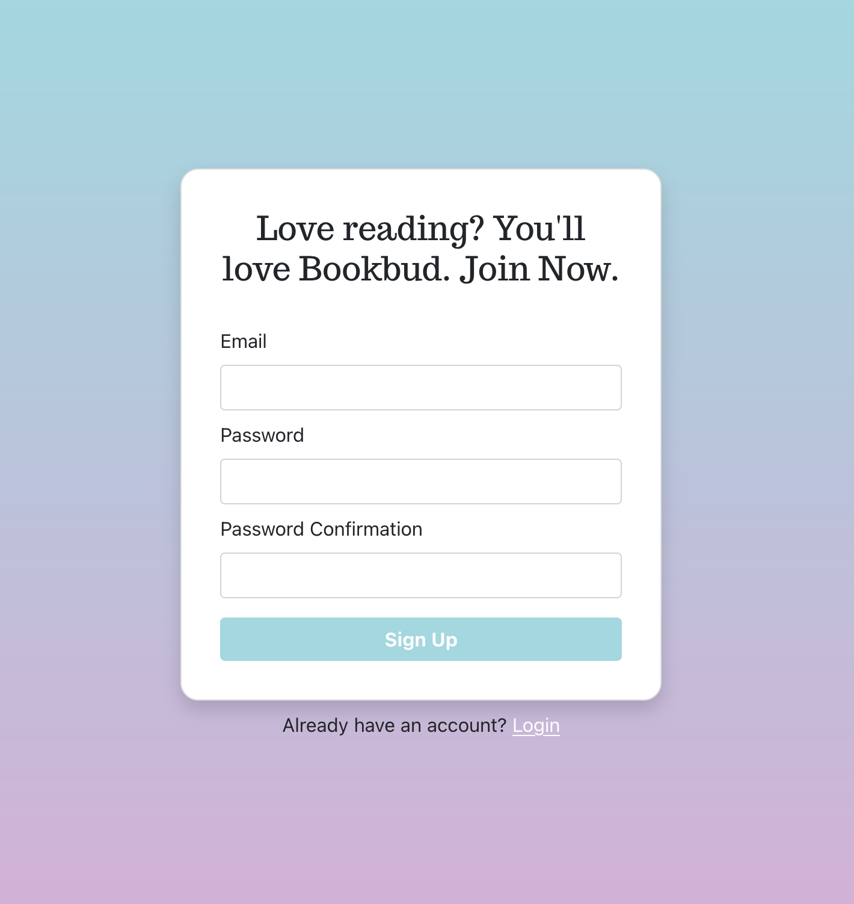
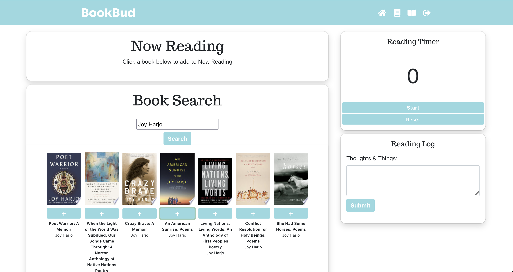
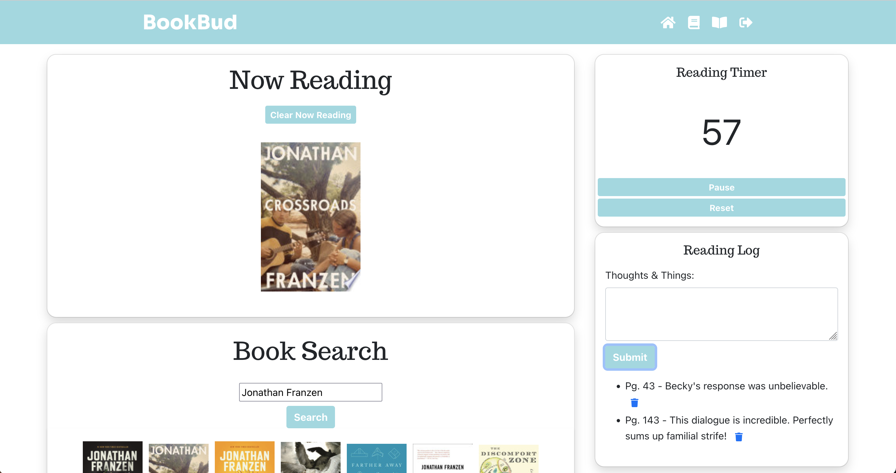
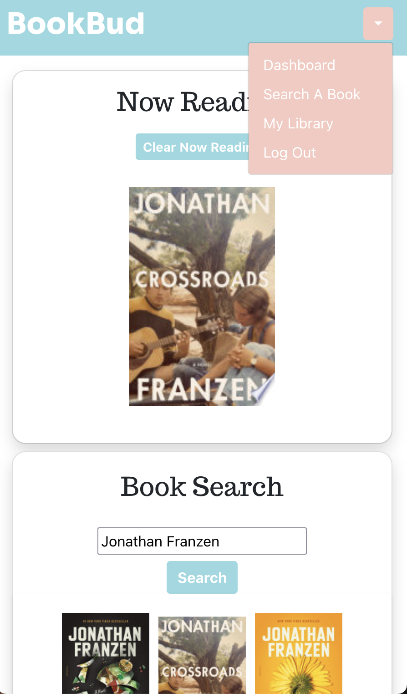

<h1 align="center"><project-name>Bookbud Reading App</h1>

<project-description>A one-stop reading app to help book lovers everywhere.

## Concept
A one-stop shop CRUD application for book lovers of any and every type. Built with React and Bootstrap, users will begin by creating a profile via Firebase, which will take them to a book search component that retrieves results powered by the Google Books API. They can then add the book to Now Reading component, record their reading time with the Reading Timer, and save notes in the Book Log. Future updates will include an Add to Library feature, and a book progress report, among other features. 

## Links

- [https://github.com/Saige243/bookbuddy](https://github.com/Saige243/bookbuddy "<project-name> Repo")

## Screenshots

Sign Up Page

Search Home Page

Now Reading with Notes

Responsive View

## Available Commands

Simply run:

### `npm start`

## Built With

- JavaScript
- React
- Bootstrap
- HTML
- CSS
- NPM

## Author

**Saige Cross**

- [Saige243 GitHub](https://github.com/Saige243 "Saige Cross")
- [saigecrossdev@gmail.com](mailto:saigecrossdev@gmail.com?subject=Hi "Hi, Saige!")

